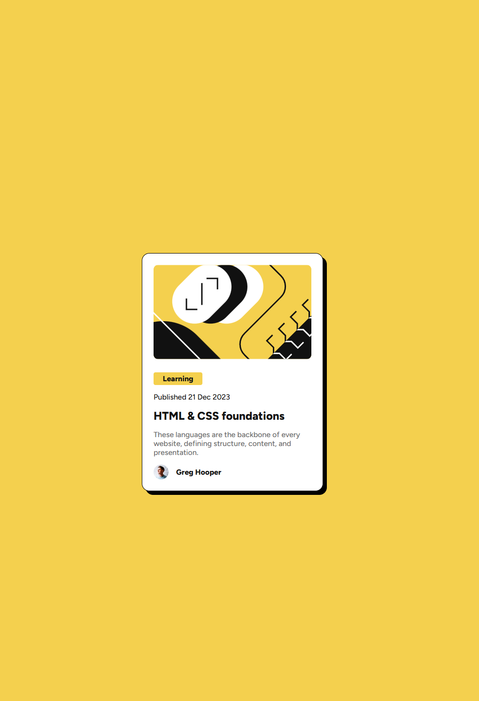

# Frontend Mentor - Blog preview card solution

This is a solution to the [Blog preview card challenge on Frontend Mentor](https://www.frontendmentor.io/challenges/blog-preview-card-ckPaj01IcS). Frontend Mentor challenges help you improve your coding skills by building realistic projects. 

## Table of contents

- [Overview](#overview)
  - [The challenge](#the-challenge)
  - [Screenshot](#screenshot)
  - [Links](#links)
- [My process](#my-process)
  - [Built with](#built-with)
  - [What I learned](#what-i-learned)
  - [Continued development](#continued-development)
- [Author](#author)

## Overview

### The challenge

Users should be able to:

- See hover and focus states for all interactive elements on the page

### Screenshot

### Links

- Solution URL: [Source Code](https://github.com/axah37/frontend-mentor-blog-preview-card)
- Live Site URL: [Live Site](https://axah37.github.io/frontend-mentor-blog-preview-card/)

## My process

### Built with

- Semantic HTML5 markup
- CSS custom properties
- Flex

### What I learned

I learned how to group my html elements to reduce potential
css clutter. Initial I had each of my elements with individual margins to align the left hand side. I refactored to use a container that contains my margin for a more consistent look, with cleaner code. 

I also learned that margins can get very weird with sibling block style elements. My margins were overlaying, causing the spacing to be less than what I expected. I learned that margins on block elements get collapsed in certain cases. 

I also got to explore the box-shadow property to add the required detail to the card as per the challenge. 

Lastly, I got to explore using flex display in different orientations and using align-items and justify-content to centre the elements.

### Continued development

In future projects, I want to continue improving my code organizations, and try to have a more modular layout from the start. I feel like I spent a lot of time fussing with the layout to align the text when I could have just wraped my content and handled alignment in one place. 

## Author

- Frontend Mentor - [@axah](https://www.frontendmentor.io/profile/axah37)
- Github - [@axah](https://www.github.com/axah37)